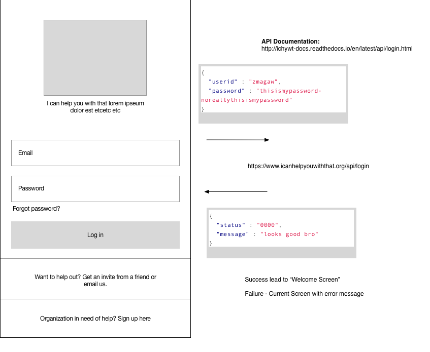

# Login UI
This screen allows a registered user to login
 - In success condition user is brought to welcome screen
 - In failure condition user is given an error 
 - If user is not registered they are able to request an invite

---
# References
 -  [Login API](../api/login.md)

---
# Flow
